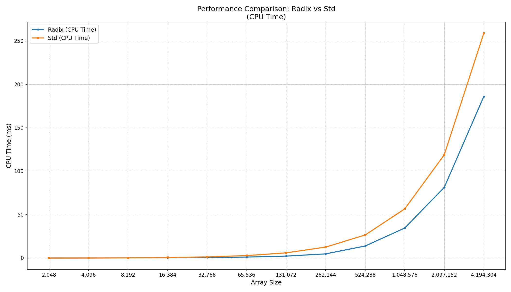

# RadixSort

This implementation uses O(2^8) additional memory to store buckets for radix sort algorithm
and for each run takes about 2KB additional space

## Performance comparison with std::sort

Run on (12 X 4024.01 MHz CPU s)

CPU Caches:

L1 Data 48 KiB (x6)

L1 Instruction 32 KiB (x6)

L2 Unified 1280 KiB (x6)

L3 Unified 12288 KiB (x1)

Load Average: 2.80, 2.55, 2.20

| Benchmark              | Time (ns)    | CPU (ns)     | Iterations |
|------------------------|--------------|--------------|------------|
| MeasureRadix/2048      | 35003        | 34825        | 22735      |
| MeasureStd/2048        | 26531        | 26531        | 29009      |
| MeasureRadix/4096      | 30973        | 30974        | 23209      |
| MeasureStd/4096        | 109119       | 109122       | 6604       |
| MeasureRadix/8192      | 142421       | 142427       | 4793       |
| MeasureStd/8192        | 274978       | 274982       | 2580       |
| MeasureRadix/16384     | 370418       | 370434       | 1874       |
| MeasureStd/16384       | 615375       | 615367       | 1164       |
| MeasureRadix/32768     | 722561       | 722578       | 966        |
| MeasureStd/32768       | 1320469      | 1320486      | 527        |
| MeasureRadix/65536     | 1129905      | 1129934      | 616        |
| MeasureStd/65536       | 2862203      | 2853192      | 251        |
| MeasureRadix/131072    | 2247538      | 2240005      | 317        |
| MeasureStd/131072      | 6012551      | 6002404      | 116        |
| MeasureRadix/262144    | 4842324      | 4823357      | 143        |
| MeasureStd/262144      | 12662947     | 12615578     | 55         |
| MeasureRadix/524288    | 13930676     | 13880536     | 48         |
| MeasureStd/524288      | 26597474     | 26579796     | 27         |
| MeasureRadix/1048576   | 34554274     | 34553724     | 20         |
| MeasureStd/1048576     | 56584187     | 56584466     | 12         |
| MeasureRadix/2097152   | 81347913     | 81329757     | 8          |
| MeasureStd/2097152     | 119344055    | 118866482    | 6          |
| MeasureRadix/4194304   | 185959791    | 185960477    | 4          |
| MeasureStd/4194304     | 258764632    | 258772992    | 3          |
| MeasureRadix/8388608   | 373362170    | 373367022    | 2          |
| MeasureStd/8388608     | 539939071    | 539940100    | 1          |