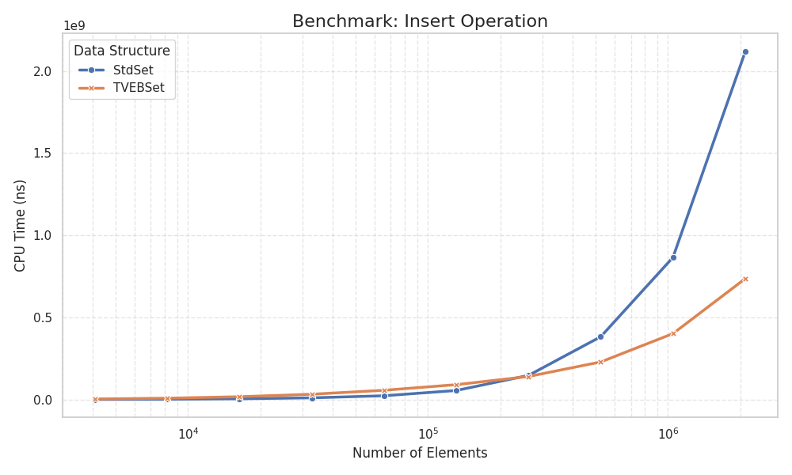
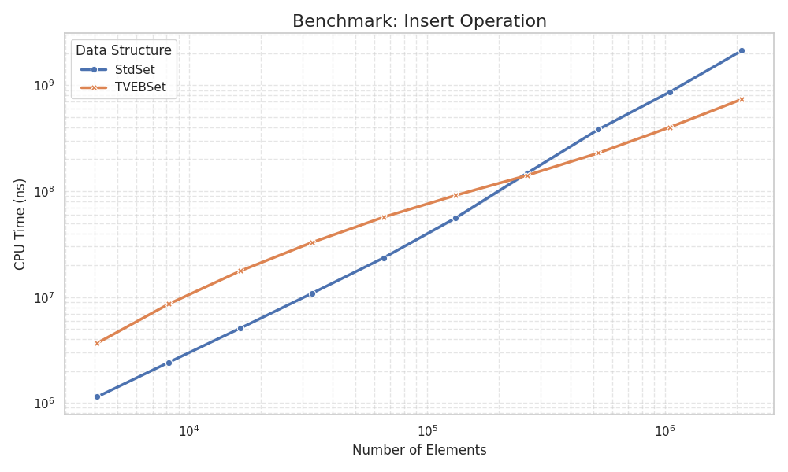
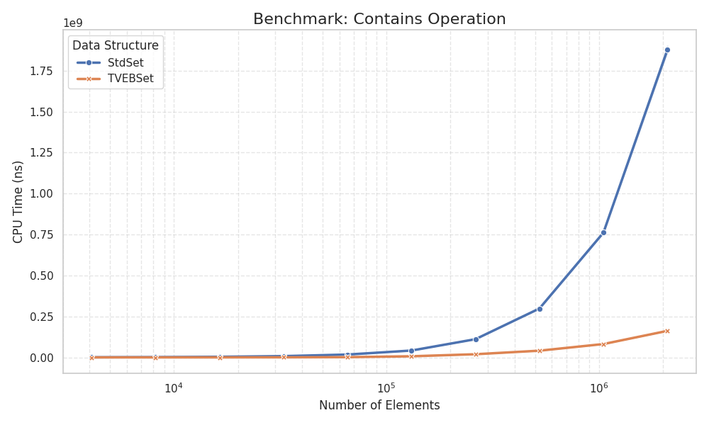
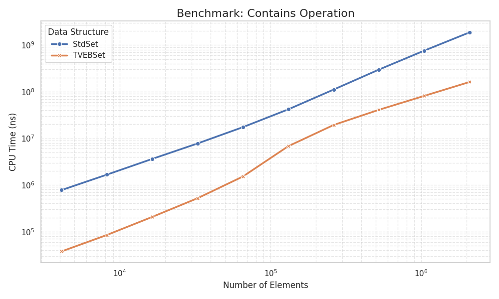
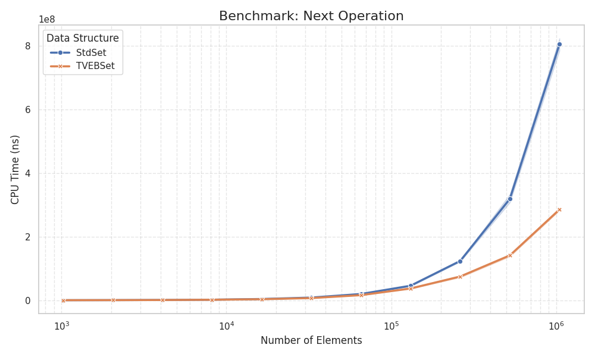
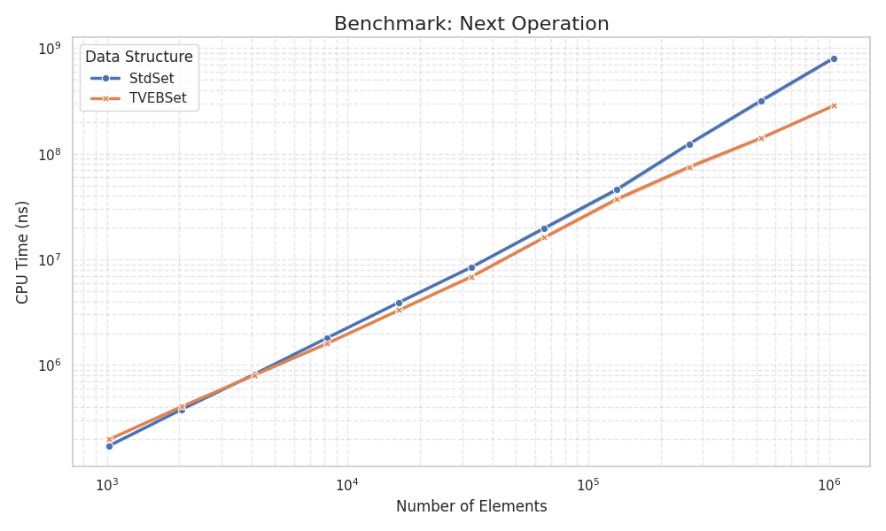

# VanEmdeBoasTree

This implementation provides a `std::set`-compatible interface for integer types, optimized for high performance and memory efficiency. The architecture decomposes the classic Van Emde Boas tree into three distinct layers to minimize memory overhead:

1.  **Root Level:** Utilizes a hash map for the high-order bits of the keys to handle sparse data efficiently, storing pointers to internal vEB trees.
2.  **Internal Level:** Follows the classic recursive vEB structure.
3.  **Basic Level:** Implements a flat, allocation-free bitmask structure for the leaf nodes.

Additionally, a custom pool allocator is employed to accelerate memory allocation for tree nodes. This hybrid approach achieves linear space complexity $O(N)$ (specifically scaled by the leaf block size) while maintaining fast access times.

## Performance comparison with std::set

|                         |                           |
|:------------------------------------------------------:|:------------------------------------------------------------------:|

|                         |                           |
|:------------------------------------------------------:|:------------------------------------------------------------------:|

|                         |                           |
|:------------------------------------------------------:|:------------------------------------------------------------------:|

*note that on small number of elements (~ N<4000) structure works worse than std::set
